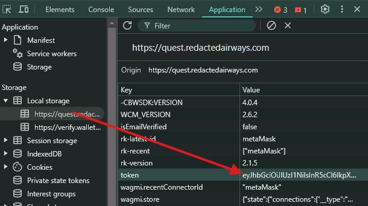

# REDACTED AUTO COMPLETE TASK
REDACTED AUTO COMPLETE TASK BOT
## Requirements
- Nodejs 
- NPM
- access-token from redacted website -  **this sc not supported multy accounts**
- get token here: [https://quest.redactedairways.com](https://quest.redactedairways.com/?r=930GBX)


## Setup

1. Clone this repository:
   ```bash
   git clone https://github.com/airdropinsiders/Redacted-Auto-Bot.git
   cd Redacted-Auto-Bot
   ```
2. Install dependencies:
   ```bash
   npm install
   ```
3. put token in token.txt: `eyJhbG....`
   ```bash
   nano token.txt
   ```
4. Run The Script:
   ```bash
   npm run start
   ```

## 

This project is licensed under the [MIT License](LICENSE).
- Source : https://github.com/Zlkcyber
